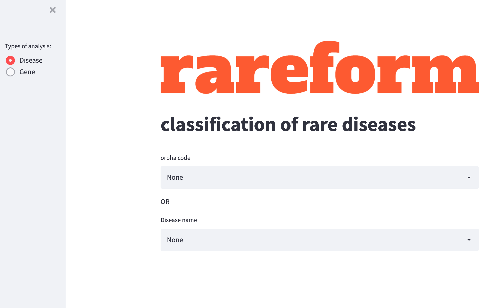
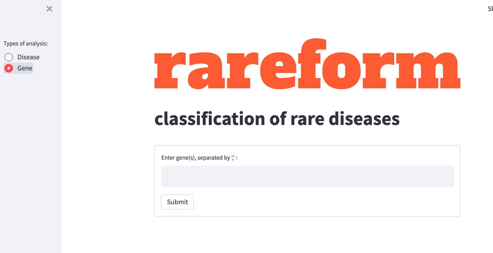

## Team 3a: Developing classification systems to compare diseases to each other
### Team Members: Awtum Brashear, Deborah Cragun, David Enoma, Chang Li, Mirshokhid Okilbekov, Motahareh Pourebehzadi, Sara Stubben 

## Background

### Rare diseases are often neglected
Rare diseases are generally defined as those with a prevalence of less than 1 in 2,000 (Ayme et al., 2015). Because of this, rare diseases are underrepresented in clinical coding systems, which leads to a lack of research and understanding of their importance and etiology (Ayme et al., 2015).

### Classification systems are of vital clinical importance
Although they are rare, these diseases have significant clinical impacts and costs (Ayme et al., 2015). Incorrectly classified diseases have consequential diagnostic implications. If a disease is classified incorrectly, a patient could undergo unnecessary or incorrect treatment.

### Existing classification systems fall short for rare diseases
The International Classification of Diseases (ICD) is used worldwide to classify diseases and causes of mortality and morbidity (Fung et al., 2020). The ICD-11 was adopted in May 2019 and began use in January 2022 (Fung et al., 2020). Many systems are still relying on ICD-10, which has significant gaps when it comes to rare diseases (Ayme et al., 2015).

Orphanet began in 1996 to help classify rare diseases (Ayme et al., 2015), and while it does have a wide array of rare disease information, this system's utility is decreased if it is not connected with other classification systems. Orphanet collaborated with the creation of ICD-11 to increase the amount of rare diseases included greater than 10-fold (Ayme et al., 2015).

Changes to the ICD-11 from ICD-10 include
1. the foundation component- a knowledge base that can e regularly updated
2. multi-hierarchical/parent system and linearization- multiple ways to classify one disease
3. digital updating (Fung et al., 2020)

Rare diseases often go by several different names, which makes finding them in classification systems difficult. When a disease is incorrectly classified or linked to an incorrect gene, these issues can be perpetuated as different systems are linked together and draw from each other. As our understanding of rare diseases changes, classifications need to be updated.

## Solution
We have developed the webapp "rareform" in order to navigate the relationship between different classification methods and find comparable diseases.

### The reform webapp
[Access the rareform WebApp](https://share.streamlit.io/awtum/topic3_teama/main/Streamlit_app.py)

#### Viewing disease attributes in reform
You can pull diseases up by Disease name, Orpha code or ICD10 code

#### Characterizing genes in reform
You can search genes or gene lists within reform

## Future Directions
We hope this design can be improved in the following ways: 
1. Comparisons between ICD 11 and ICD 10 
2. Incorporation of genetic information to improve medical coding and grouping 
3. Clinical significance - diagnostics
4. Clean up of existing classification systems and databases

## References
Ayme, S., Bellet, B., & Rath, A. (2015). Rare diseases in ICD11: Making rare diseases visible in health information systems through appropriate coding. *Orphanet Journal of Rare Diseases, 10*, 35. https://doi.org/10.1186/s13023-015-0251-8

Fung, K. W., Xu, J., & Bodenreider, O. (2020). The new International Classification of Diseases 11th edition: a comparative analysis with ICD-10 and ICD-10-CM. *Journal of the American Medical Informatics Association, 27*(5), 738-746. https://dx.doi.org/10.1093%2Fjamia%2Focaa030
